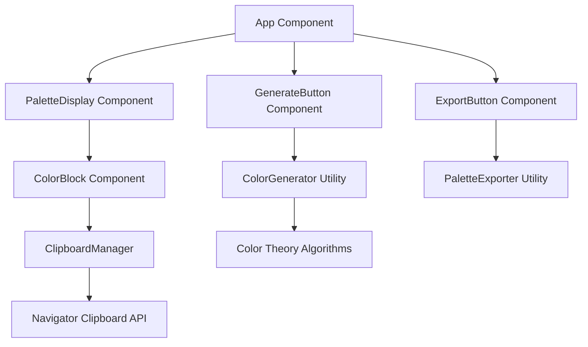

# Design Document: Color Palette Picker

## Overview

The Color Palette Picker is a single-page React application that generates harmonious color palettes using scientifically-based color theory algorithms. The application provides an intuitive interface for designers and developers to quickly generate, view, and copy color codes for their projects.

The system architecture follows a component-based approach with clear separation of concerns: color generation logic, UI presentation, clipboard management, and optional data export functionality.

## Architecture

### High-Level Architecture



### Component Hierarchy

- **App**: Root component managing application state
- **PaletteDisplay**: Container for color blocks with responsive layout
- **ColorBlock**: Individual color display with click-to-copy functionality
- **GenerateButton**: Triggers new palette generation
- **ExportButton**: Optional component for JSON export

## Components and Interfaces

### Core Components

#### App Component
```typescript
interface AppState {
  currentPalette: string[];
  isGenerating: boolean;
  copyFeedback: { colorIndex: number; visible: boolean } | null;
}

interface AppProps {}
```

#### ColorBlock Component
```typescript
interface ColorBlockProps {
  hexCode: string;
  index: number;
  onCopy: (hexCode: string, index: number) => void;
  showCopyFeedback: boolean;
}
```

#### PaletteDisplay Component
```typescript
interface PaletteDisplayProps {
  colors: string[];
  onColorCopy: (hexCode: string, index: number) => void;
  copyFeedback: { colorIndex: number; visible: boolean } | null;
}
```

### Utility Interfaces

#### ColorGenerator
```typescript
interface ColorGenerator {
  generateHarmoniousPalette(): string[];
  generateDefaultPalette(): string[];
}

interface ColorHarmony {
  type: 'analogous' | 'complementary' | 'triadic' | 'monochromatic';
  baseHue: number;
  colors: string[];
}
```

#### ClipboardManager
```typescript
interface ClipboardManager {
  copyToClipboard(text: string): Promise<boolean>;
  isClipboardSupported(): boolean;
}
```

## Data Models

### Color Palette Model
```typescript
interface ColorPalette {
  id: string;
  colors: string[];
  createdAt: Date;
  harmonyType?: string;
}

interface ColorInfo {
  hex: string;
  rgb: { r: number; g: number; b: number };
  hsl: { h: number; s: number; l: number };
}
```

### Export Data Model
```typescript
interface PaletteExportData {
  palette: {
    colors: string[];
    timestamp: string;
    harmonyType?: string;
  };
  metadata: {
    generator: string;
    version: string;
  };
}
```

## Color Generation Algorithm

The color generation system uses established color theory principles to create visually harmonious palettes:

### Algorithm Selection
Based on research, the system will implement multiple harmony types:
- **Analogous**: Adjacent colors on the color wheel for natural, calming palettes
- **Complementary**: Opposite colors for high contrast and vibrancy
- **Triadic**: Three evenly spaced colors for balanced, vibrant combinations
- **Monochromatic**: Variations of a single hue for sophisticated, cohesive palettes

### Implementation Strategy
1. **Base Color Selection**: Generate a random hue (0-360°) as the foundation
2. **Harmony Application**: Apply selected harmony rules to derive related colors
3. **Saturation & Lightness Variation**: Adjust S and L values for visual interest
4. **Aesthetic Filtering**: Ensure colors meet minimum contrast and aesthetic standards

### Default Palette
The initial palette will use analogous harmony with nature-inspired hues (greens, blues, earth tones) and moderate saturation for a calming, professional appearance.

## User Interface Design

### Glassmorphism Implementation
The UI will implement glassmorphism effects using TailwindCSS utilities:

```css
/* Core glassmorphism classes */
.glass-card {
  @apply bg-white/20 backdrop-blur-lg rounded-xl border border-white/30;
  @apply shadow-2xl hover:shadow-3xl transition-all duration-300;
}

.glass-color-block {
  @apply backdrop-blur-sm rounded-lg border border-white/20;
  @apply hover:scale-105 transition-transform duration-200;
}
```

### Responsive Layout
- **Desktop**: 5 color blocks in a horizontal row
- **Tablet**: 5 blocks with adjusted spacing
- **Mobile**: Stacked layout or 2-3 blocks per row based on screen width

### Interactive Elements
- **Hover Effects**: Subtle scale transforms and shadow changes
- **Click Feedback**: Brief animation and visual confirmation for copy actions
- **Loading States**: Smooth transitions during palette generation

### Color Block Design
Each color block will feature:
- Large color area for easy clicking
- Hex code overlay with high contrast text
- Smooth hover animations
- Copy confirmation feedback

## Clipboard Integration

### Implementation Approach
The clipboard functionality uses the modern `navigator.clipboard.writeText()` API with proper error handling:

```typescript
async function copyToClipboard(text: string): Promise<boolean> {
  try {
    if (!navigator.clipboard) {
      throw new Error('Clipboard API not supported');
    }
    
    await navigator.clipboard.writeText(text);
    return true;
  } catch (error) {
    console.error('Failed to copy to clipboard:', error);
    return false;
  }
}
```

### Fallback Strategy
For browsers without clipboard API support, the system will:
1. Display the hex code prominently for manual copying
2. Show a "Copy not supported" message
3. Provide alternative selection methods

### User Feedback
- **Success**: Brief green checkmark or "Copied!" message
- **Failure**: Red indicator with fallback instructions
- **Duration**: 2-second feedback display with fade-out animation

## Technical Implementation

### Build Configuration
- **Framework**: React 18+ with functional components and hooks
- **Build Tool**: Vite for fast development and optimized production builds
- **Styling**: TailwindCSS for utility-first styling and responsive design
- **TypeScript**: For type safety and better development experience

### Project Structure
```
src/
├── components/
│   ├── App.tsx
│   ├── PaletteDisplay.tsx
│   ├── ColorBlock.tsx
│   ├── GenerateButton.tsx
│   └── ExportButton.tsx
├── utils/
│   ├── colorGenerator.ts
│   ├── clipboardManager.ts
│   └── paletteExporter.ts
├── types/
│   └── index.ts
├── styles/
│   └── globals.css
└── main.tsx
```

### Performance Considerations
- **Color Generation**: Memoized calculations to prevent unnecessary re-renders
- **Component Optimization**: React.memo for pure components
- **Bundle Size**: Tree-shaking and code splitting for optimal loading
- **Animations**: CSS transforms for hardware acceleration

## Correctness Properties

*A property is a characteristic or behavior that should hold true across all valid executions of a system-essentially, a formal statement about what the system should do. Properties serve as the bridge between human-readable specifications and machine-verifiable correctness guarantees.*

Based on the prework analysis, the following properties validate the system's correctness:

### Property 1: Palette Generation Consistency
*For any* palette generation request, the Color_Palette_Generator should always produce exactly 5 valid hex color codes
**Validates: Requirements 1.1**

### Property 2: UI State Synchronization  
*For any* color palette update, the Palette_Display should immediately reflect the new colors in the user interface
**Validates: Requirements 1.2**

### Property 3: Color Block Display Completeness
*For any* set of 5 colors provided to the Palette_Display, each color should be rendered as a separate block showing its corresponding hex code
**Validates: Requirements 2.1, 2.2**

### Property 4: Responsive Layout Adaptation
*For any* viewport size change, the Palette_Display should maintain proper layout structure and readability across different screen dimensions
**Validates: Requirements 2.3**

### Property 5: Glassmorphism Styling Consistency
*For any* rendered color palette interface, all interactive elements should display glassmorphism effects including rounded corners, backdrop blur, and subtle shadows
**Validates: Requirements 2.4, 4.3**

### Property 6: Clipboard Copy Functionality
*For any* color block click event, the system should copy the corresponding hex code to the clipboard using the navigator.clipboard.writeText() API
**Validates: Requirements 3.1, 3.3**

### Property 7: Copy Feedback Display
*For any* successful clipboard copy operation, the UI should display visual confirmation feedback that automatically disappears after a set duration
**Validates: Requirements 3.2**

### Property 8: Clipboard Error Handling
*For any* clipboard API failure, the system should handle the error gracefully without crashing and provide appropriate user feedback
**Validates: Requirements 3.4**

### Property 9: Hover Animation Response
*For any* interactive element hover event, the system should apply smooth visual transitions and animations
**Validates: Requirements 4.2**

### Property 10: Export Data Completeness
*For any* palette export operation (when enabled), the generated JSON should contain exactly 5 hex codes matching the current palette
**Validates: Requirements 5.1, 5.2**

### Property 11: Export Filename Generation
*For any* palette export, the system should generate a meaningful filename that includes timestamp or palette identifier information
**Validates: Requirements 5.3**

### Property 12: Client-Side Operation
*For any* application functionality, the system should operate without making external server requests or requiring backend services
**Validates: Requirements 6.4**

## Error Handling

### Clipboard API Failures
- **Detection**: Check for `navigator.clipboard` availability
- **Fallback**: Display hex code prominently for manual copying
- **User Feedback**: Clear error messages with alternative instructions
- **Graceful Degradation**: Application remains functional without clipboard features

### Color Generation Errors
- **Invalid Colors**: Validate hex codes before display
- **Generation Failures**: Fallback to default palette
- **State Recovery**: Maintain previous valid palette if generation fails

### UI Rendering Issues
- **Component Errors**: Error boundaries to prevent application crashes
- **Responsive Failures**: Fallback layouts for unsupported screen sizes
- **Animation Failures**: Graceful degradation to static states

## Testing Strategy

### Dual Testing Approach
The application will use both unit tests and property-based tests for comprehensive coverage:

**Unit Tests** focus on:
- Specific examples of color generation algorithms
- Edge cases like clipboard API unavailability
- Component rendering with known inputs
- Error conditions and boundary values

**Property-Based Tests** focus on:
- Universal properties that hold across all color inputs
- UI behavior consistency across different viewport sizes
- Clipboard functionality across various hex code formats
- Export functionality with randomized palette data

### Property-Based Testing Configuration
- **Framework**: Use `@fast-check/jest` for property-based testing in React
- **Iterations**: Minimum 100 iterations per property test
- **Test Tagging**: Each property test references its design document property
- **Tag Format**: `// Feature: color-palette-picker, Property {number}: {property_text}`

### Testing Implementation
Each correctness property will be implemented as a single property-based test that validates the universal behavior across all valid inputs. Unit tests will complement these by testing specific examples and edge cases that demonstrate correct behavior in known scenarios.

The testing strategy ensures that both the general correctness (via properties) and specific implementation details (via examples) are thoroughly validated, providing confidence in the application's reliability and user experience.